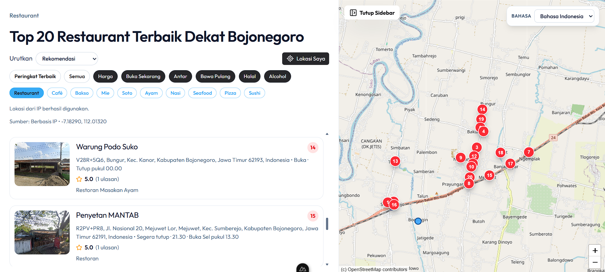

# Rasanta Backend (Go + Fiber)



Backend Rasanta adalah API untuk pencarian dan detail tempat (Google Maps parser), digunakan oleh frontend Nuxt di folder `website/`.

## Ringkasan

- Bahasa: Go (module `rasanta`)
- HTTP Framework: Fiber v2
- Endpoint utama:
  - `GET /api/v1/places`
  - `GET /api/v1/places/detail`
- Health check:
  - `GET /`
  - `GET /health`

## Prasyarat

- Go 1.25+ (lihat `go.mod`)
- GNU Make (opsional, untuk shortcut command)

## Konfigurasi Environment

1. Salin file contoh:

```bash
cp .env.example .env
```

2. Isi nilai penting:

- `PORT` (default backend di `3000`)
- `HTTP_TIMEOUT_SECONDS`
- `GOOGLE_MAPS_USER_AGENT`
- `GOOGLE_MAPS_COOKIE_FILE` atau `GOOGLE_MAPS_COOKIE`

Contoh path cookie default:

- `.secrets/google_maps_cookie.txt`

## Menjalankan Backend

### Cara cepat (tanpa Make)

```bash
go run cmd/server/main.go
```

### Menggunakan Makefile

```bash
make deps
make run
```

Mode hot reload (Air):

```bash
make air-install
make dev
```

Build binary:

```bash
make build
```

Test dan format:

```bash
make test
make fmt
```

## Endpoint API

### 1) GET /api/v1/places

Query params yang umum dipakai:

- `query` (default: `restaurant`)
- `lat` (default: `-7.2575`)
- `lng` (default: `112.7521`)
- `limit` (default: `20`)
- `saw` (default: `false`)
- `hl` (default: `id`)
- `gl` (default: `id`)
- `authuser` (default: `0`)
- `rating_weight` (default: `0.6`)
- `reviews_weight` (default: `0.3`)
- `price_weight` (default: `0.1`)

Contoh:

```bash
curl "http://localhost:3000/api/v1/places?query=restaurant&lat=-7.2575&lng=112.7521&limit=20&saw=true&hl=id&gl=US&authuser=0"
```

### 2) GET /api/v1/places/detail

Bisa pakai salah satu cara:

- Kirim `pb` langsung, atau
- Kirim `data_id` + `lat` + `long` (backend akan membentuk `pb` otomatis)

Query params tambahan:

- `query`
- `hl`
- `gl`
- `authuser`

Contoh:

```bash
curl "http://localhost:3000/api/v1/places/detail?data_id=0x2dd7f...&lat=-7.2575&long=112.7521&hl=id&gl=US&authuser=0"
```

## Struktur Folder (Backend)

- `cmd/server/main.go` - entrypoint server
- `internal/app` - inisialisasi app Fiber
- `internal/router` - registrasi route
- `internal/handler` - parsing request HTTP
- `internal/service` - business logic
- `internal/repository` - akses ke data source Google Maps
- `pkg/gmapsparser` - parser payload mentah

## Integrasi Frontend

Frontend ada di folder `website/`, default memanggil backend di:

- `http://localhost:3000`

Pastikan backend aktif sebelum menjalankan frontend.

## License

Proyek ini dilisensikan di bawah [MIT License](LICENSE).
